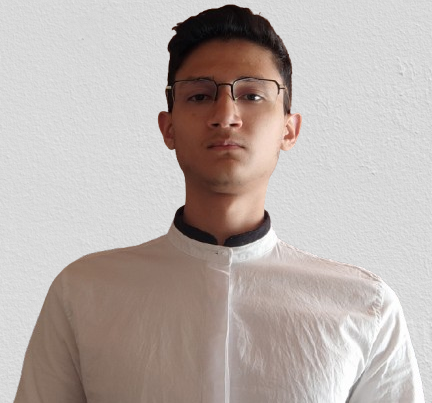
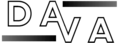
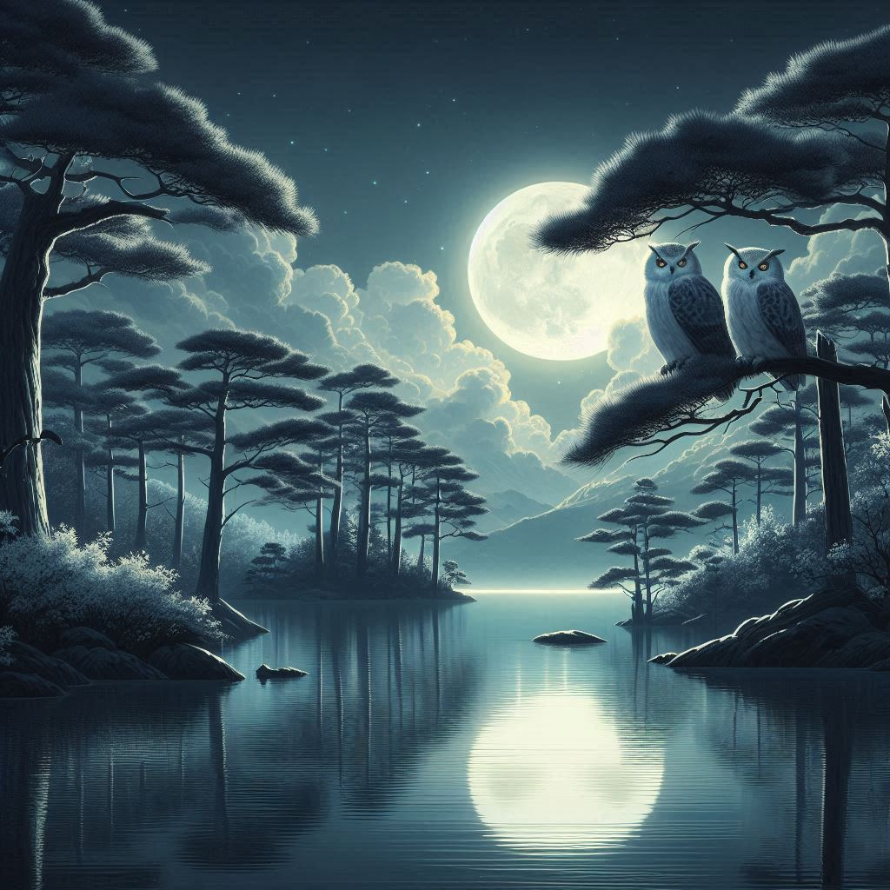

# Mi portafolio

## YO

### Hola, soy  **DAVID**
Este es mi portafolio personal.

## Modo Oscuro/Claro
  
## Cambio de Idioma

[ENG](https://portafolio-david-v.netlify.app/indexen) / [ESP]([index.html](https://portafolio-david-v.netlify.app/))

## Navegación

- [Inicio](#hero)
- [Sobre mi](#sobre_Mi)
- [Habilidades](#habilidades)
- [Proyectos](#projects)
- [Contacto](#contact)

## Resumen

[RESUMEN](#) proximamente...

### Redes Sociales

- [LinkedIn](#)
- [GitHub](#)
- [Twitter](#)

## Sobre Mi
## Habilidades

### Técnicas

- HTML 
- CSS 
- JavaScript 
- Git 

### Pasivas

- [x] Trabajo en equipo
- [x] Adaptabilidad
- [x] Resolución de problemas

## Proyectos

## Contacto

Si tienen preguntas o recomendaciones no duden en enviarme un correo electrónico.

[dvanegasf2023@gmail.com](mailto:dvanegasf2023@gmail.com)

## Footer

© 2024 David. Todos los derechos reservados.

### Redes Sociales

- [LinkedIn](#)
- [GitHub](#)
- [Twitter](#)
